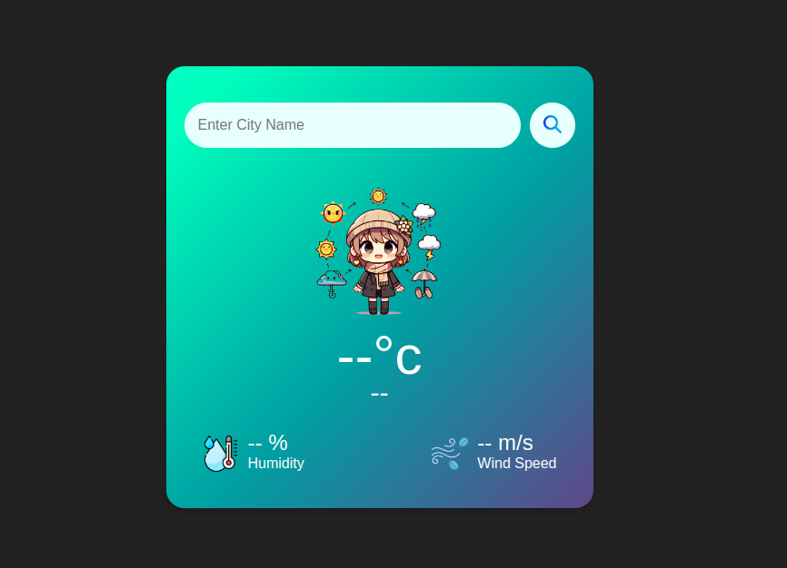

# Simple Weather App



## Overview

The Simple Weather App is a web application that allows users to get real-time weather information for any city. Users can input a city name to retrieve current weather conditions, including temperature, humidity, and wind speed. The app also displays an appropriate weather chibi icon based on the weather conditions.

## Features

- Search for real-time weather information by city name
- Display temperature, humidity, and wind speed
- Dynamic weather icons based on weather conditions
- Responsive design for optimal viewing on all devices

## Technologies Used

- HTML5
- CSS3
- JavaScript (embedded in HTML)
- OpenWeatherMap API

## Setup and Installation

### Prerequisites

- Web browser (Chrome, Firefox, Safari, etc.)
- Internet connection

### Installation Steps

1. **Clone the Repository**

    ```bash
    git clone https://github.com/yourusername/simple-weather-app.git
    ```

2. **Navigate to the Project Directory**

    ```bash
    cd simple-weather-app
    ```

3. **Open `index.html` in Your Browser**


## Usage

1. **Enter a City Name**: Type the name of the city you want to check the weather for in the search bar.

2. **Search**: Click the search button or press the Enter key to fetch the weather information.

3. **View Weather**: The current weather information, including temperature, humidity, and wind speed, will be displayed along with an appropriate weather icon.

## Code Structure

- **index.html**: The main HTML file that structures the app and contains the embedded JavaScript code.
- **styles.css**: The CSS file that styles the app.
- **images/**: Directory containing weather icons and other images used in the app.

## API Integration

This app uses the OpenWeatherMap API to fetch real-time weather data. You need an API key from OpenWeatherMap to use this app. Replace the `apiKey` variable in the `<script>` tag in `index.html` with your own API key.

```javascript
const apiKey = "your_openweathermap_api_key";
```

## Contributing

Contributions are welcome! Please follow these steps to contribute:

1. Fork the repository.
2. Create a new branch.
3. Make your changes and commit them.
4. Push your changes to your forked repository.
5. Submit a pull request with a detailed description of your changes.

## License

This project is licensed under the MIT License. See the [LICENSE](LICENSE) file for more details.

## Acknowledgements

- [OpenWeatherMap](https://openweathermap.org/) for providing the weather API.

